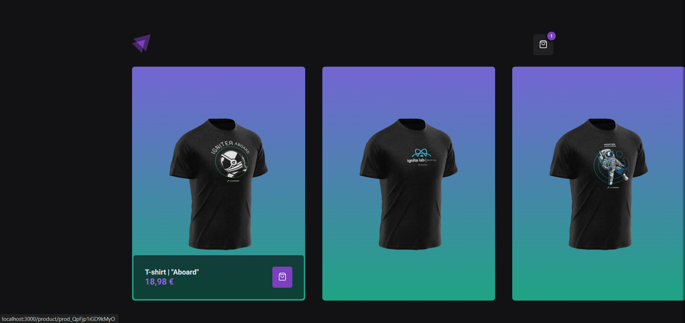
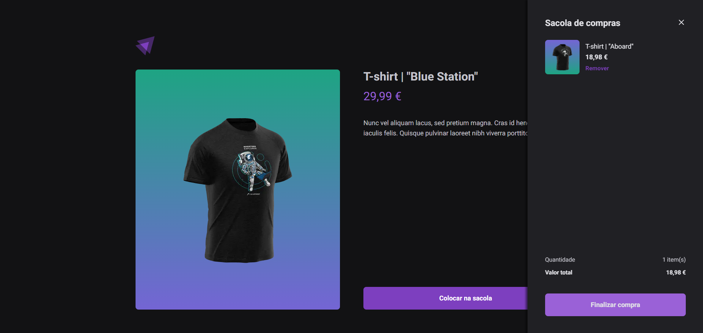
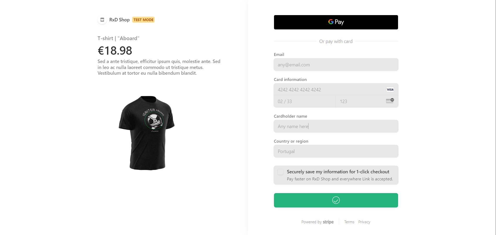
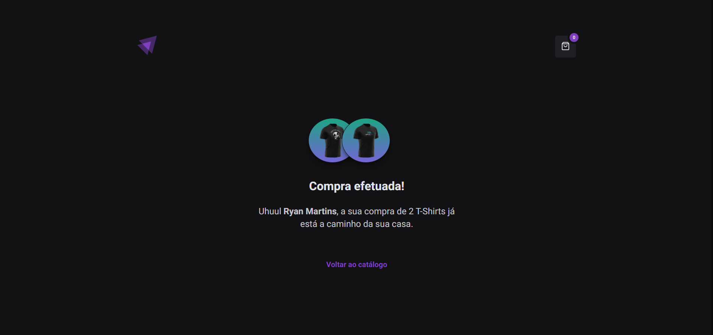

# E-commerce Next.js 14

Este projeto é um **E-commerce Fictício** desenvolvido em **Next.js** com **TypeScript** e **Stitches**. A aplicação integra o **Stripe** para a criação de produtos, checkout e pagamentos, oferecendo uma experiência de compra completa e fluida. Com uma estrutura otimizada, a aplicação utiliza **Server-Side Rendering (SSR)** e **Static Site Generation (SSG)**, garantindo excelente performance e SEO.

## Imagens da Aplicação

- **Página Inicial:** Apresenta os produtos disponíveis com opções de filtragem.


- **Detalhes do Produto:** Fornece informações detalhadas sobre cada produto.


- **Página de Checkout:** Integração com o Stripe para processamento de pagamentos.


- **Página de Sucesso:** Confirmação de pedidos após finalização do pagamento.


## Tecnologias Utilizadas

- **Next.js:** Framework React para aplicações web.
- **TypeScript:** Superset do JavaScript para maior segurança na tipagem.
- **Stitches:** Biblioteca para estilização.
- **Stripe:** Plataforma de pagamentos.

## Funcionalidades

- **Side Menu:** Permite a navegação fácil entre as páginas e acesso rápido aos produtos inseridos no carrinho.
- **Local Storage:** Armazena os produtos adicionados ao carrinho, mantendo a persistência mesmo após o fechamento do navegador.

## Como executar o projeto

1. Clone o repositório:
   ```bash
   git clone https://github.com/ryanx3/rxd-shop
   cd rxd-shop

## Scripts

Para rodar a aplicação, utilize os seguintes comandos:

```bash
# Instale as dependências
npm install

# Construa a aplicação
npm run build

# Inicie o servidor
npm start
```

# Contribuição

Sinta-se à vontade para contribuir! Faça um fork do projeto, crie uma branch para suas alterações e envie um pull request.

# Licença

Este projeto está licenciado sob a MIT License. Veja o arquivo `LICENSE` para mais detalhes.
